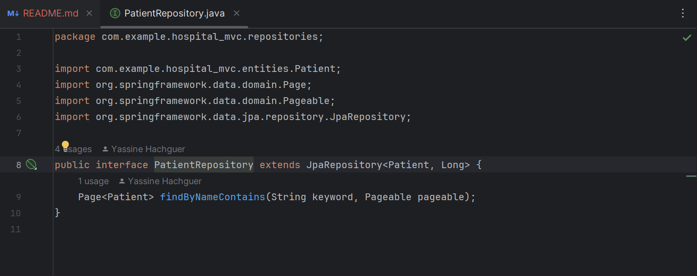

#  Gestion des Patients Spring MVC Thylemeaf Spring Data JPA
## Composants d'Application
### Package Entities
### `Patient`

### Package Repositories
### `PatientRepository`

### Package Web
### `PatientController`

### Application Principale
### `HospitalMvcApplication`

### Test du Code Avec H2 Database

### Test du Code Avec MySql Database

